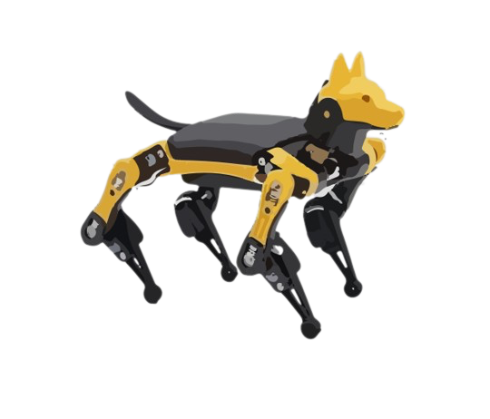

## About

This project aims to push the boundaries of computer vision in miniature robots using the Petoi Bittle as a testbed. While computer vision has been extensively studied in larger robots, it remains relatively unexplored in small-scale robotics. By implementing computer vision algorithms such as object classification, obstacle avoidance, and face detection, we aim to evaluate the capabilities of the MU Vision Sensor 3 and other limited-capacity cameras for performing these tasks. If successful, we will explore the possibility of introducing a "hide and seek" feature to the robot, which would require it to execute multiple algorithms simultaneously. This project has the potential to advance our understanding of computer vision in robotics and may lead to new possibilities for miniature robot applications.

## Rough Approach towards the project:

1. Bittle can be able to identify obstacles/objects (for example, as bittle is walking and find obstacles it will stop and sit down) 
2. Bittle can perform obstacle avoidance (for example, as bittle is walking it is able to determine to go over obstacles) 
3. Bittle can also perform face detection 

